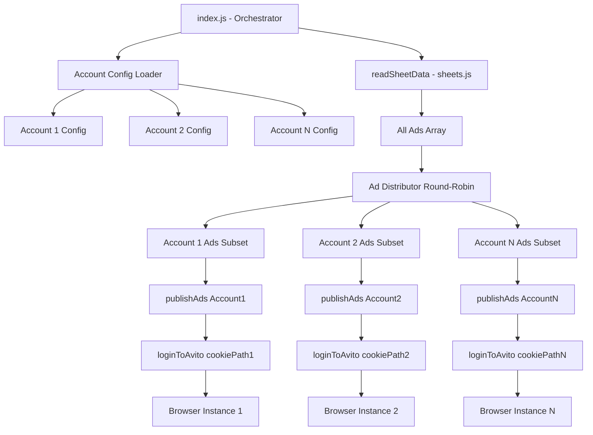
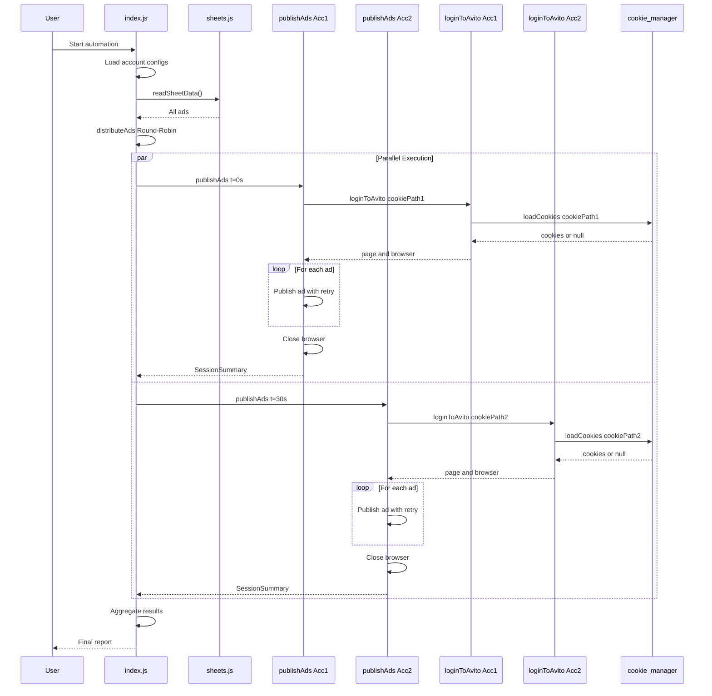

# Multi-Session Avito Automation - Technical Specification

**Version:** 1.0  
**Date:** 2025-10-26  
**Status:** Design Phase

---

## Table of Contents

1. [Executive Summary](#executive-summary)
2. [System Architecture](#system-architecture)
3. [Data Structures](#data-structures)
4. [Module Specifications](#module-specifications)
5. [Orchestration Flow](#orchestration-flow)
6. [Error Handling Strategy](#error-handling-strategy)
7. [Logging Strategy](#logging-strategy)
8. [Testing Strategy](#testing-strategy)
9. [Migration Path](#migration-path)
10. [Resource Management](#resource-management)
11. [Configuration Guidelines](#configuration-guidelines)

---

## 1. Executive Summary

### 1.1 Objective
Refactor the Avito automation system from single-session to multi-session architecture, enabling parallel ad publishing across multiple Avito accounts while maintaining backward compatibility.

### 1.2 Key Requirements
- Support configurable N accounts (not hardcoded)
- Round-robin ad distribution algorithm
- Staggered browser launches (30-second delays)
- Maximum 3 concurrent browser instances
- Retry logic for failed ads (same account)
- Backward compatibility with single-account mode
- Account-specific logging with clear identification

### 1.3 Benefits
- **Performance**: 2-3x faster ad publishing through parallelization
- **Scalability**: Easy to add more accounts as needed
- **Reliability**: Isolated sessions prevent cross-account failures
- **Flexibility**: Toggle between single/multi-account modes

---

## 2. System Architecture

### 2.1 Current Architecture (Single-Session)
```
index.js
    ↓
publishAds()
    ↓
loginToAvito() → readSheetData() → Process Ads Sequentially
    ↓
saveCookies(page) / loadCookies()
    ↓
COOKIE_FILE = "avito_cookies.json" (hardcoded)
```

### 2.2 New Architecture (Multi-Session)
```
index.js (Orchestrator)
    ↓
┌─────────────────────────────────────────────────────────┐
│  Configuration Loading & Validation                      │
│  - Load account configs from directory                   │
│  - Read all ads from Google Sheets (once)                │
│  - Validate resources (max 3 concurrent)                 │
└─────────────────────────────────────────────────────────┘
    ↓
┌─────────────────────────────────────────────────────────┐
│  Ad Distribution (Round-Robin)                           │
│  Account1: [Ad1, Ad4, Ad7, ...]                          │
│  Account2: [Ad2, Ad5, Ad8, ...]                          │
│  Account3: [Ad3, Ad6, Ad9, ...]                          │
└─────────────────────────────────────────────────────────┘
    ↓
┌─────────────────────────────────────────────────────────┐
│  Parallel Execution with Staggered Start                 │
│  t=0s:    Account1 → publishAds()                        │
│  t=30s:   Account2 → publishAds()                        │
│  t=60s:   Account3 → publishAds()                        │
│  (Promise.all() waits for all to complete)               │
└─────────────────────────────────────────────────────────┘
    ↓
Each Account Session:
    loginToAvito(cookieFilePath) → Process Assigned Ads → Close Browser
         ↓
    loadCookies(cookieFilePath) / saveCookies(page, cookieFilePath)
         ↓
    куки для avito_automation kuhni/{accountName}/avito_cookies.json
```

### 2.3 Component Interaction Diagram



---

## 3. Data Structures

### 3.1 Account Configuration Object

```javascript
/**
 * @typedef {Object} AccountConfig
 * @property {string} name - Display name for the account (for logging)
 * @property {string} email - Account email (informational only)
 * @property {string} cookiePath - Absolute path to cookie file
 * @property {boolean} enabled - Whether this account is active
 * @property {number} [maxAds] - Optional: max ads this account can handle
 * @property {number} [retryLimit] - Optional: number of retries for failed ads (default: 2)
 */

// Example:
const accountConfig = {
    name: "Account1_Liliya",
    email: "1liliya.a@mail.ru",
    cookiePath: "/Users/rus/Desktop/avito n8n + Скрипт/avito_automation kuhni/куки для avito_automation kuhni/1liliya.a@mail.ru La10102006/avito_cookies.json",
    enabled: true,
    maxAds: 50,
    retryLimit: 2
};
```

### 3.2 Ad Distribution Result

```javascript
/**
 * @typedef {Object} AdDistribution
 * @property {AccountConfig} account - The account configuration
 * @property {Array<Object>} ads - Array of ad objects assigned to this account
 * @property {number} startIndex - Starting index in the original ads array
 * @property {number} endIndex - Ending index in the original ads array
 */

// Example:
const distribution = {
    account: accountConfig,
    ads: [ad1, ad4, ad7], // Round-robin distributed
    startIndex: 0,
    endIndex: 2
};
```

### 3.3 Publication Result

```javascript
/**
 * @typedef {Object} AdPublicationResult
 * @property {string} adTitle - Title of the ad
 * @property {string} accountName - Account that published the ad
 * @property {boolean} success - Whether publication succeeded
 * @property {string} [url] - Published ad URL (if successful)
 * @property {Error} [error] - Error object (if failed)
 * @property {number} attemptCount - Number of attempts made
 * @property {number} timestamp - Publication timestamp
 */

// Example:
const result = {
    adTitle: "Кухня модульная белая",
    accountName: "Account1_Liliya",
    success: true,
    url: "https://www.avito.ru/items/123456789",
    attemptCount: 1,
    timestamp: 1698345600000
};
```

### 3.4 Session Summary

```javascript
/**
 * @typedef {Object} SessionSummary
 * @property {string} accountName - Account name
 * @property {number} totalAds - Total ads assigned
 * @property {number} successCount - Successfully published ads
 * @property {number} failedCount - Failed ads
 * @property {number} duration - Session duration in milliseconds
 * @property {Array<AdPublicationResult>} results - Detailed results
 */

// Example:
const summary = {
    accountName: "Account1_Liliya",
    totalAds: 25,
    successCount: 23,
    failedCount: 2,
    duration: 1800000, // 30 minutes
    results: [/* array of AdPublicationResult */]
};
```

---

## 4. Module Specifications

### 4.1 cookie_manager.js

#### Changes Required
- Remove hardcoded `COOKIE_FILE` constant
- Add `cookieFilePath` parameter to both functions
- Add path validation

#### New Function Signatures

```javascript
/**
 * Saves cookies from the Puppeteer page to a JSON file.
 * 
 * @param {import('puppeteer').Page} page - The Puppeteer page instance
 * @param {string} cookieFilePath - Absolute path to the cookie file
 * @returns {Promise<void>}
 * @throws {Error} If cookie saving fails or path is invalid
 * 
 * @example
 * await saveCookies(page, '/path/to/account1/avito_cookies.json');
 */
async function saveCookies(page, cookieFilePath) {
    // Implementation details in code phase
}

/**
 * Loads cookies from the JSON file and returns them.
 * 
 * @param {string} cookieFilePath - Absolute path to the cookie file
 * @returns {Array<Object>|null} Array of cookie objects or null if file doesn't exist
 * @throws {Error} If cookie loading fails (except file not found)
 * 
 * @example
 * const cookies = loadCookies('/path/to/account1/avito_cookies.json');
 * if (cookies) {
 *     await page.setCookie(...cookies);
 * }
 */
function loadCookies(cookieFilePath) {
    // Implementation details in code phase
}

module.exports = { saveCookies, loadCookies };
```

---

### 4.2 avito_login.js

#### Changes Required
- Add `cookieFilePath` parameter
- Pass `cookieFilePath` to cookie manager functions
- Return both `page` and `browser` for proper cleanup
- Add account identification in logs

#### New Function Signature

```javascript
/**
 * Logs into Avito using saved cookies or manual login.
 * Returns a Puppeteer page with active Avito session.
 * 
 * @param {string} cookieFilePath - Absolute path to the cookie file for this account
 * @param {string} [accountName='DefaultAccount'] - Account name for logging purposes
 * @returns {Promise<{page: import('puppeteer').Page, browser: import('puppeteer').Browser}>} 
 *          Object containing authenticated page and browser instance
 * @throws {Error} If browser launch fails or login timeout
 * 
 * @example
 * const { page, browser } = await loginToAvito(
 *     '/path/to/cookies.json',
 *     'Account1_Liliya'
 * );
 * try {
 *     // Use page for automation
 * } finally {
 *     await browser.close();
 * }
 */
async function loginToAvito(cookieFilePath, accountName = 'DefaultAccount') {
    // Implementation details in code phase
}

module.exports = loginToAvito;
```

#### Browser Isolation
Each `loginToAvito()` call creates an **independent browser instance** with:
- Separate user data directory (implicit, no shared state)
- Isolated cookies (loaded from different files)
- Independent network sessions
- No cross-contamination between accounts

---

### 4.3 publish_ads.js

#### Changes Required
- Refactor to accept parameters instead of reading sheets internally
- Process only the ads passed as parameter
- Add account-specific logging prefix
- Return detailed results array
- Accept browser/page from caller (or create new one)

#### New Function Signature

```javascript
/**
 * Publishes a subset of ads using the specified account.
 * 
 * @param {Array<Object>} adsSubset - Array of ad objects to publish
 * @param {string} cookieFilePath - Absolute path to the cookie file
 * @param {string} accountName - Account identifier for logging
 * @param {Object} [options] - Optional configuration
 * @param {number} [options.retryLimit=2] - Number of retry attempts per ad
 * @param {number} [options.delayBetweenAds=5000] - Delay between ads in ms
 * @returns {Promise<SessionSummary>} Summary of the publishing session
 * @throws {Error} If login fails or critical error occurs
 * 
 * @example
 * const results = await publishAds(
 *     [ad1, ad2, ad3],
 *     '/path/to/cookies.json',
 *     'Account1_Liliya',
 *     { retryLimit: 3, delayBetweenAds: 3000 }
 * );
 * console.log(`Published ${results.successCount}/${results.totalAds} ads`);
 */
async function publishAds(adsSubset, cookieFilePath, accountName, options = {}) {
    // Implementation details in code phase
}

module.exports = publishAds;
```

---

### 4.4 index.js (Orchestrator)

#### Configuration Structure

```javascript
const CONFIG = {
    mode: process.env.AVITO_MODE || 'multi',
    maxConcurrentBrowsers: 3,
    staggerDelay: 30000,
    cookieBaseDir: path.join(__dirname, 'куки для avito_automation kuhni'),
    retryLimit: 2,
    delayBetweenAds: 5000,
    legacyCookiePath: path.join(__dirname, 'avito_cookies.json')
};
```

#### Key Functions

```javascript
function loadAccountConfigs() { /* ... */ }
function distributeAds(ads, accounts) { /* ... */ }
async function executeParallelSessions(distributions, config) { /* ... */ }
async function runSingleAccountMode() { /* ... */ }
async function runMultiAccountMode() { /* ... */ }
async function main() { /* ... */ }
```

---

## 5. Orchestration Flow

### 5.1 Sequence Diagram



---

## 6. Error Handling Strategy

### 6.1 Error Categories

| Error Type | Severity | Handling Strategy |
|------------|----------|-------------------|
| **Configuration Error** | Critical | Halt immediately, report to user |
| **Login Failure** | Critical | Halt session for that account, continue others |
| **Network Timeout** | Moderate | Retry up to limit, then skip ad |
| **Form Field Error** | Moderate | Retry up to limit, then skip ad |
| **Photo Upload Error** | Low | Log warning, continue ad |
| **Browser Crash** | Critical | Restart browser, retry current ad |

### 6.2 Retry Pattern with Exponential Backoff

```javascript
async function retryWithBackoff(fn, maxRetries = 3, baseDelay = 1000) {
    for (let attempt = 1; attempt <= maxRetries; attempt++) {
        try {
            return await fn();
        } catch (error) {
            if (attempt === maxRetries) throw error;
            
            const delay = baseDelay * Math.pow(2, attempt - 1);
            console.log(`Retry ${attempt}/${maxRetries} after ${delay}ms`);
            await new Promise(resolve => setTimeout(resolve, delay));
        }
    }
}
```

---

## 7. Logging Strategy

### 7.1 Log Format

```
[TIMESTAMP] [ACCOUNT_NAME] [LEVEL] Message

Examples:
[2025-10-26 17:30:15] [Account1_Liliya] [INFO] Starting session with 25 ads
[2025-10-26 17:31:22] [Account1_Liliya] [SUCCESS] ✓ Published: "Кухня модульная"
[2025-10-26 17:32:05] [Account2_Arface] [WARNING] ⚠ Photo upload failed
[2025-10-26 17:33:18] [Account1_Liliya] [ERROR] ✗ Failed: "Кухня угловая"
```

### 7.2 Logger Implementation

```javascript
class Logger {
    constructor(accountName = 'System') {
        this.accountName = accountName;
    }
    
    _log(level, message, ...args) {
        const timestamp = new Date().toISOString().replace('T', ' ').substring(0, 19);
        const prefix = `[${timestamp}] [${this.accountName}] [${level}]`;
        console.log(prefix, message, ...args);
    }
    
    info(message, ...args) { this._log('INFO', message, ...args); }
    success(message, ...args) { this._log('SUCCESS', '✓', message, ...args); }
    warning(message, ...args) { this._log('WARNING', '⚠', message, ...args); }
    error(message, ...args) { this._log('ERROR', '✗', message, ...args); }
    critical(message, ...args) { this._log('CRITICAL', '🔴', message, ...args); }
}
```

---

## 8. Testing Strategy

### 8.1 Unit Tests

```javascript
// Test Suite 1: Cookie Manager
describe('Cookie Manager', () => {
    test('saveCookies creates file with valid cookies');
    test('loadCookies returns null for non-existent file');
    test('loadCookies returns cookie array for valid file');
});

// Test Suite 2: Ad Distribution
describe('Ad Distribution', () => {
    test('distributeAds splits evenly for 2 accounts, 10 ads');
    test('distributeAds round-robin for 3 accounts, 10 ads');
    test('distributeAds skips disabled accounts');
});
```

### 8.2 Integration Tests

```javascript
describe('Multi-Account Mode', () => {
    test('executes parallel sessions with stagger');
    test('respects maxConcurrentBrowsers limit');
});
```

### 8.3 Error Scenario Tests

```javascript
describe('Error Handling', () => {
    test('retries failed ad up to limit');
    test('marks ad as failed after retry limit');
    test('continues with other ads after one fails');
});
```

---

## 9. Migration Path

### 9.1 Migration Phases

#### Phase 1: Preparation (Non-Breaking)
- Update modules to accept optional parameters
- Add deprecation warnings
- Add CONFIG object with backward-compatible defaults

#### Phase 2: Account Setup
- Create account directory structure
- Copy/create cookie files for each account
- Test manual login for each account

#### Phase 3: Implementation
- Implement multi-account functions
- Keep single-account mode functional
- Add environment variable toggle

#### Phase 4: Testing
```bash
# Test single mode
AVITO_MODE=single node index.js

# Test multi mode
AVITO_MODE=multi node index.js
```

#### Phase 5: Rollout
- Week 1: Default `single`, announce feature
- Week 2: Allow opt-in to `multi`
- Week 3: Switch default to `multi`
- Week 4: Deprecate `single` mode

### 9.2 Rollback Plan

```bash
# Immediate rollback
git checkout <previous-commit>
npm install
AVITO_MODE=single node index.js

# Restore cookies
cp avito_cookies.json.backup avito_cookies.json
```

---

## 10. Resource Management

### 10.1 Resource Constraints

| Resource | Single Account | Multi-Account (2) | Multi-Account (3) |
|----------|----------------|-------------------|-------------------|
| **Memory** | ~500MB | ~1GB | ~1.5GB |
| **CPU** | 1 core @ 50% | 2 cores @ 40% | 3 cores @ 40% |
| **Network** | 1-2 Mbps | 2-4 Mbps | 3-6 Mbps |
| **Disk I/O** | Low | Moderate | Moderate |

### 10.2 Performance Optimization

**Staggered Starts**: Prevent resource spikes
```javascript
const staggerDelay = 30000; // 30 seconds between account starts
```

**Max Concurrent Browsers**: Prevent memory exhaustion
```javascript
const maxConcurrentBrowsers = 3; // Maximum 3 browsers at once
```

**Browser Cleanup**: Ensure proper resource release
```javascript
try {
    // Publishing logic
} finally {
    if (browser) {
        await browser.close();
    }
}
```

### 10.3 Monitoring

Track these metrics:
- Memory usage per browser instance
- Total concurrent browsers
- Ad publishing rate (ads/minute)
- Success rate per account
- Network bandwidth usage

---

## 11. Configuration Guidelines

### 11.1 Environment Variables

```bash
# Mode selection
export AVITO_MODE=multi  # or 'single'

# Resource limits
export AVITO_MAX_CONCURRENT=3
export AVITO_STAGGER_DELAY=30000

# Retry configuration
export AVITO_RETRY_LIMIT=2
export AVITO_AD_DELAY=5000
```

### 11.2 Account Directory Structure

```
куки для avito_automation kuhni/
├── 1liliya.a@mail.ru La10102006/
│   └── avito_cookies.json
├── arface.laha@mail.ru Ra13052006/
│   └── avito_cookies.json
└── account3@example.com/
    └── avito_cookies.json
```

### 11.3 Best Practices

1. **Account Naming**: Use descriptive names for easy identification
2. **Cookie Management**: Regularly refresh cookies (re-login)
3. **Ad Distribution**: Start with 2 accounts, scale to 3 if needed
4. **Error Monitoring**: Review failed ads and retry manually if needed
5. **Rate Limiting**: Respect Avito's rate limits (stagger helps)

---

## 12. Implementation Checklist

### Pre-Implementation
- [x] Design complete technical specification
- [ ] Review specification with stakeholders
- [ ] Approve function signatures and data structures
- [ ] Set up test environment

### Implementation Phase